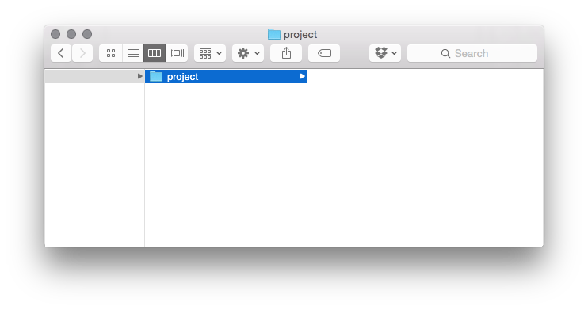
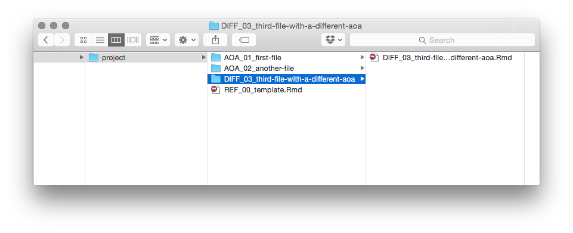

### What dames ?

dames stands for **d**ata n**ames**. 

Data names are file names with consistent formatting: 
- Variables are consitently ordered
- Variables are predictably delimited by a consistent separator. 
- Variables are things like:
  - date (`1991-07-03`)
  - abbreviation-or-accronym (`AOA`)
  - slug-formatted-descriptor (`slug-name-of-file-that-describes-its-contents`)
  - file extension (`ext`).

For example:
```
AOA_01_slug-name-of-file-that-describes-its-contents.ext
```

### Why dames ?

I was doing this manually in my projects and decided to make it easier on myself.
Use damed .Rmd files damed according to a logical projection (numbered indices) 
annotated with useful abbreviations/acronyms and slug-form names to be kind to 
future me.

### How do I use it ?

From your project directory:

```r
setwd("path/to/my/project")
```


you can build up your project with `nd`

```r
nd("first file")
nd("another file")
nd("third file with a different aoa",aoa = "DIFF")
```


Where the output of each op is an damed `.Rmd` file that contains a child link to the REF_template.Rmd (for common stuff) and a YAML header configured for keeping a github-flavoured markdown when knitting to html.

#### but why a folder for each ?

This has two purposes:

1. with github hosting if you rename the knitted `.md` to `README.md` it will automatically preview in each directory. one way to do this:

```r
file.rename(list.files(pattern = "\\.md$"), "README.md")
```

2. keeps all the bits relevant to a section in the same handy folder so everything is easy to find later on (making the location of the contents usefully informative).

### notes
- many good people have put out great education on naming/organization of stuffs. Make a list.
- every time you use an aoa for the first time it should be added to a lexicon.csv file that lives in the project directory.
